# Mini-NoC

A packet-switched network-on-chip and the SoC around it, built from scratch in
SystemVerilog and running on a ZedBoard — with every endpoint reachable as a
host on a real IP network.

Nothing here is vendor IP wired together. The flit format, crossbar, arbiter,
FIFOs, memory adapter, AXI4-Lite bridge and hardware forwarding table are all
original RTL. So is the software that puts them on a network. The only vendor
parts are the Zynq processing system, its Ethernet MAC, and lwIP.

**Send a UDP datagram to `10.10.10.13` and it arrives at endpoint 3**, because a
forwarding table in the PL looked up the address and rewrote the packet header.
Move that endpoint to a different address while traffic is flowing, and it keeps
working. Deny endpoints 4-7 with a router ACL, and 0-3 carry on.

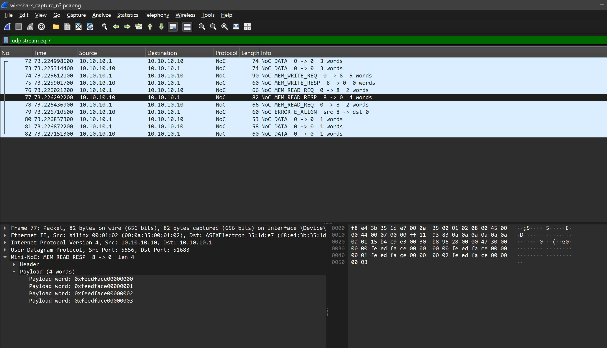

*A memory read crossing the crossbar, leaving the FPGA and decoded field by
field on the wire: the four `0xfeedface` words were read out of BRAM inside the
PL.*

---

## What it does

**The interconnect.** Eight bidirectional endpoints plus a shared-memory
endpoint exchange variable-length packets through a 9x10 crossbar. Per-output
round-robin arbitration with whole-packet locking, lossless ready/valid
backpressure, destination latched at start of packet, illegal destinations drained
to a sink port so a bad header cannot block an input.

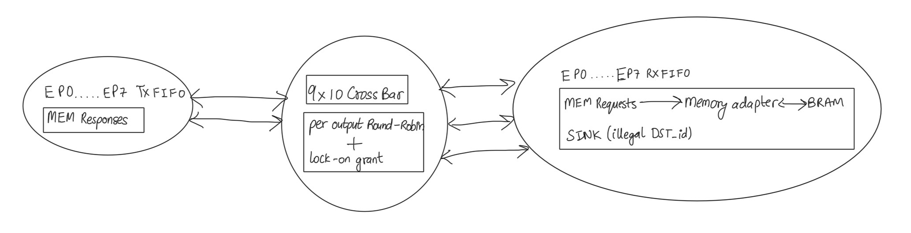

**The SoC.** An AXI4-Lite bridge replaces one endpoint's traffic generator, so
the Zynq PS injects and receives flits. A 16-entry IPv4-to-endpoint forwarding
table sits on the datapath and is writable at runtime.

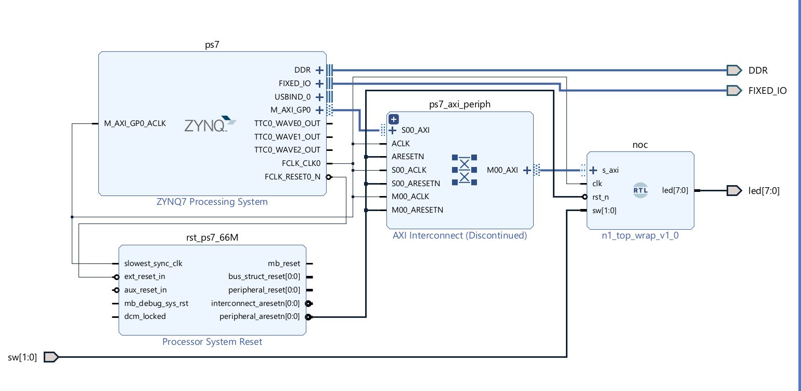

**The network.** lwIP on the PS carries UDP datagrams to and from the bridge.
Nine IPv4 addresses answer ARP and ICMP behind one MAC, each mapping to an
endpoint. A control port lets the host read and rewrite the forwarding table
while the board is running.

```
host 10.10.10.1 ──Ethernet──► Zynq PS (lwIP) ──AXI-Lite──► fwd_table ──flits──► endpoints
                  10.10.10.10 .. .17 = endpoints 0-7       10.10.10.18 = shared memory
```

---

## Results

|                 |                                                                             |
| --------------- | --------------------------------------------------------------------------- |
| Timing          | **Closes at 70 MHz** on xc7z020-1; measured ceiling 73.6 MHz          |
| Hardware        | Zero errors under randomised receive backpressure                           |
| Verification    | Reference-model scoreboard;**11 of 11 mutation bugs caught**          |
| Area            | 7518 LUTs (14%), 4114 registers, 2 BRAM, including the self-test harness    |
| MMIO throughput | 3.4 MB/s each way, ~285 ns per bus access                                   |
| Network         | All nine addresses reachable; routing by address; live remap; ACL filtering |

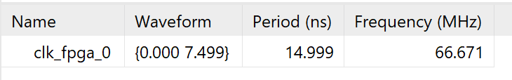

The critical path is the arbitration loop — one input's destination decides
another input's ready — at 82% routing across 13 logic levels. That is the
73.6 MHz ceiling, and lifting it needs credit-based flow control, not tuning.
The full closure history, from WNS -6.466 ns, is in the report.

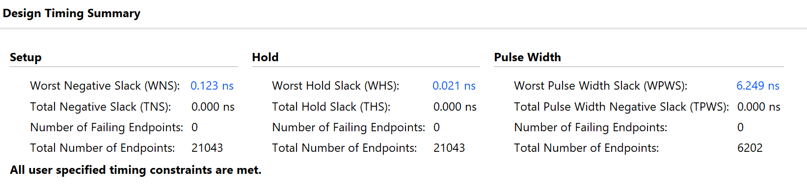

---

## Verified on hardware

**The fabric**, with eight on-chip generators and checkers driving it:

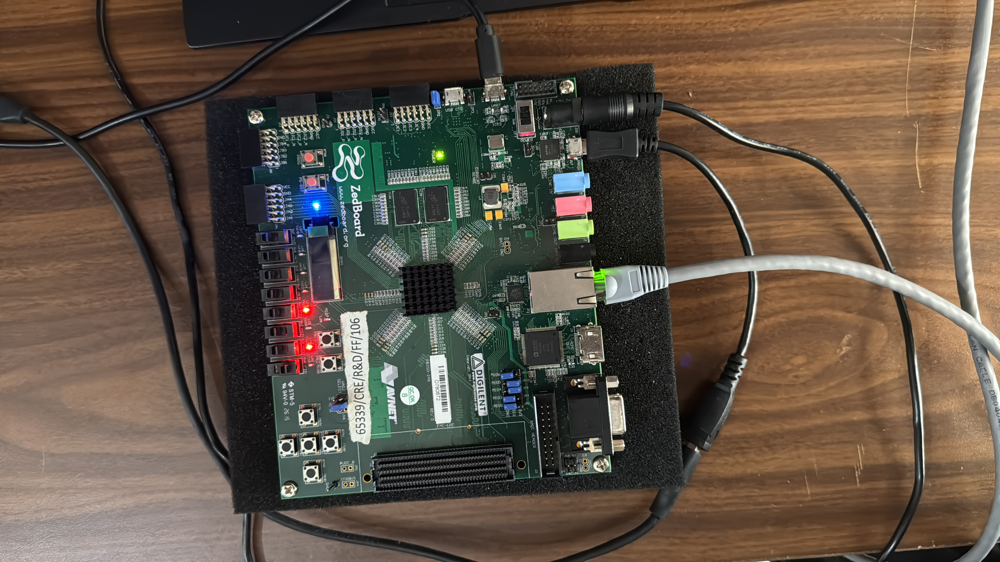

**Every endpoint answers as a host**, all behind one MAC:

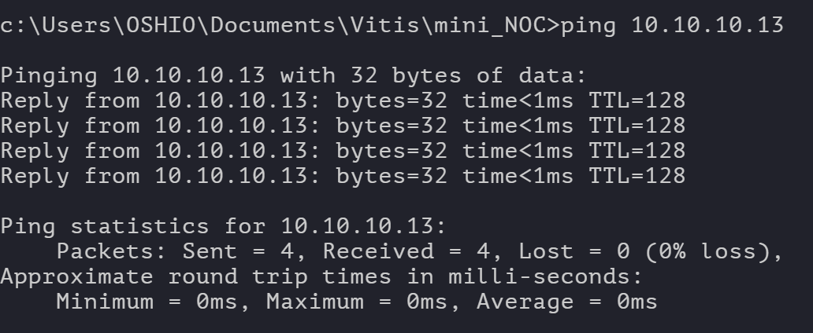
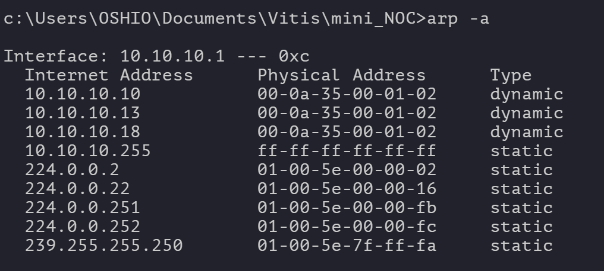

**Errors surface on the wire** with the code, the source endpoint and the tag of
the request that caused them:

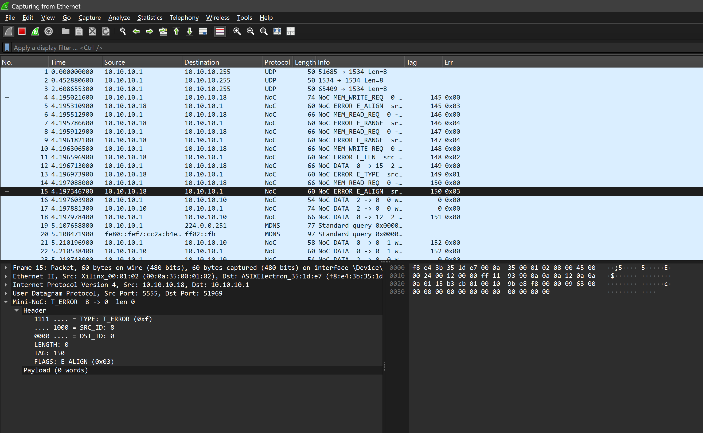

**An endpoint moves address while running**, with no rebuild and no reboot:

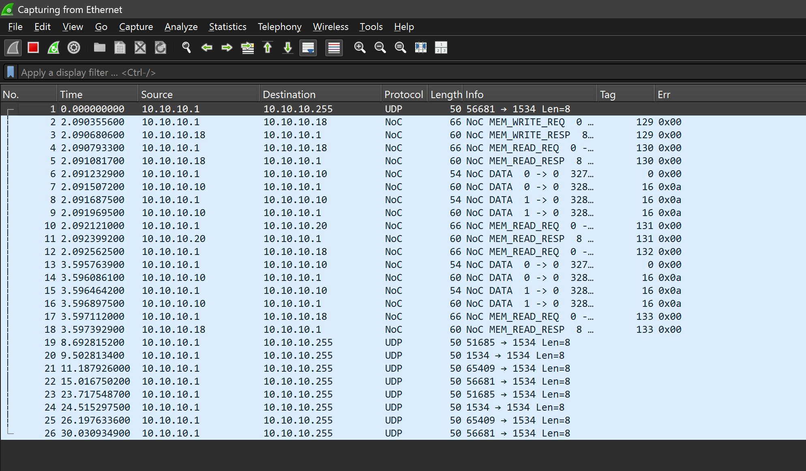

**A router ACL filters the endpoint address space**, two hops away:

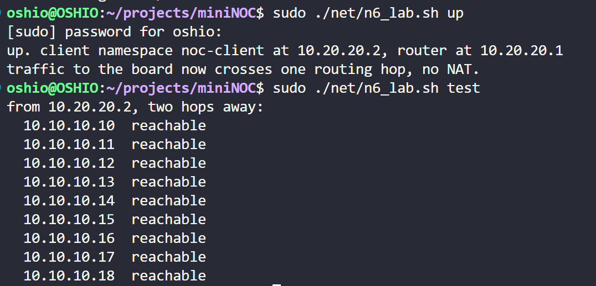

**The testbenches are proven to catch bugs**, not merely to pass:

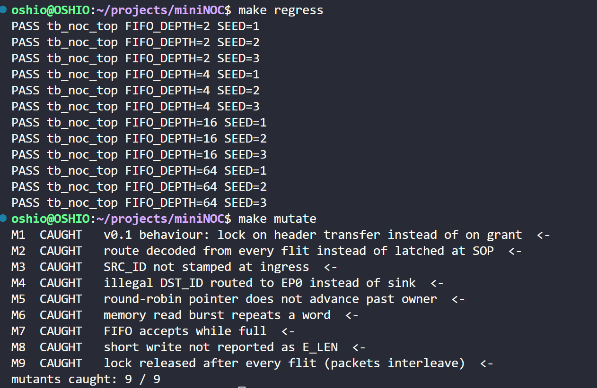

---

## Layout

```
rtl/      noc_pkg, rr_arbiter, sync_fifo, skid_reg, bram_sdp, endpoint_port,
          route_decode, output_port_ctrl, noc_switch, memory_adapter, noc_top,
          axil_noc_bridge (AXI4-Lite), fwd_table (IPv4 -> endpoint)
tb/       arbiter, FIFO, system scoreboard, board self-test, bridge + forwarding
fpga/     ep_traffic, zed_top, zedboard.xdc, build.tcl        (self-test design)
          n1_top, n1.xdc, n1_bd.tcl                           (PS + bridge design)
sw/       noc_bridge (driver), noc_udp (UDP + control plane), noc_alias (ARP/ICMP),
          n1_main (AXI-Lite acceptance), n3_main (networked application)
net/      noc_dissector.lua, n3_test.py, n4_remap.py, n5_errors.py, n6_lab.sh,
          make_test_pcap.py
docs/     consolidated report, design spec, network spec, v0.1 review
pictures/ captures and photographs
```

## Build and run

Simulation needs Verilator 5.x:

```
make lint          make unit          make regress
make selftest      make n1            make mutate
```

FPGA, from the repository root:

```
vivado -mode batch -source fpga/build.tcl     # self-test bitstream
vivado -mode batch -source fpga/n1_bd.tcl     # PS + bridge, exports n1.xsa
```

Then build the Vitis application from `sw/` on the exported platform. Host-side,
with the board at 10.10.10.10 and the laptop at 10.10.10.1:

```
python net/n3_test.py --by-address    # routing by destination address
python net/n4_remap.py                # move an endpoint to a new address, live
python net/n5_errors.py               # every error path, from the host
sudo ./net/n6_lab.sh up && sudo ./net/n6_lab.sh acl && sudo ./net/n6_lab.sh test
```

For Wireshark, copy `net/noc_dissector.lua` into the personal plugins folder and
filter on `noc`. `net/make_test_pcap.py` writes a synthetic capture so the
decoder can be checked without hardware.

`BUILD.md` has the full build notes, including the two BSP settings that are not
defaults and the stale-bitstream traps. `PLAN.md` tracks what is done and what is
open. `docs/mini_noc_complete_report.docx` is the consolidated report: design
specification, network specification, results and retrospective.

## Status

Both tracks complete on hardware. Open: fabric-only area figure, AXI-DMA in place
of MMIO, and credit-based flow control to lift the frequency ceiling.
